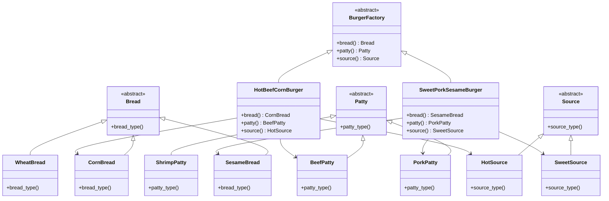

# 팩토리 패턴
>팩토리 패턴이란?  
서로 관련된 객체들을 생성하는 인터페이스를 제공하지만, 구체적인 클래스는 노출하지 않는 패턴

# 용어 정리
<details>
<summary>1. Spring</summary>
java는 정적인 언어라 객체를 만들때 파이썬보다 유동성이 떨어짐.    
이 부분을 Spring이라는 프레임워크가 대신 관리,생성(IoC/DI)하여 해결함.
</details>

<br>

<details>
<summary>2. IoC</summary>
관계 역전 (Inversion of Control).  
객체 간의 제어권(혹은 관계의 주도권)을 개발자가 아닌 외부나 상위 구조가 가진다는 개념

```py
chicken = HotChicken()
cook.fry(chicken)
```

이건 chicken이라는 객체를 개발자가 직접 만들어 넣는 구조임.

```py
factory = ChickenFactory()
chicken = factory.create_hot_chicken()
cook.fry(chicken)
```

이건 객체 생성의 제어권을 공장에의해 만들어지는거임.  

요약 : “클라이언트 → 객체”가 아니라 “공장 → 객체”로 이동  

추가 설명 : 공장 코드도 내가 쓰고 내가 만드는데 당연히 둘 다 클라이언트가 주입하는거지;; 라고 생각 할 수 있음. 그런데 조금만 더 생각해보자.  
chicken을 만드려면 클라이언트는 HotChicken이라는 클래스를 만들어야함. 그래서 치킨을 만드는 래시피를 모두 알고 있어야함.  
하지만 factory를 통해 만들면? factory에는 chicken을 만들기 위한 모든 레시피가 들어있어서 클라이언트는 레시피를 몰라도 chichen을 생성 할 수 있음.
</details>

<br>

<details>
<summary>3. DI</summary>
의존성 주입(Dependency Injection)  
IoC의 한 방법으로 객체 간의 의존 관계를 외부에서 주입해주는 설계 패턴.
python에는 대표적으로 fastapi의 depend가 있음.

```py
from fastapi import APIRouter, Depends

def check_token(token:str)->str:
    if token != "my-secret-token:
        raise TypeError("혀용된 형식의 토큰이 아님")
    return token
```
위 코드는 라우터에 주입할 의존성 함수임.

```py
router = APIRouter(prefix="/home", dependencies=[Depends(check_token)])

@router.get("/")
    def read_root():
        return "Accessed granted, you can view the items"
```
APIRouter에 check_token을 의존성 주입하여 라우터 내부 함수가 실행되기 전에 먼저 실행됨.  
read_root()함수는 check_token이 무엇을 검사했는지, 어떤 동작을 하는지 몰라도 이미 인증된 요청만 통과했다는 전제하에 안전하게 실행할 수 있음.

</details>

<br>
<br>

# 추상 팩토리 패턴을 사용하는 이유
팩토리 메서드 패턴은 객체 생성 메서드를 상위클래스에 정의해두고. 어떻게 만들지는 하위 클래스에서 정하게 하는것 임.  
```py
from abc import ABC, abstractmethod

class Burger(ABC):
    @abstractmethod
    def burger_type(self):
        pass

class HotChickenBurger(Burger):
    def burger_type(self):
        return "매운 치킨 버거"

class BurgerFactory(ABC):
    @abstractmethod
    def create_burger(self) -> Burger:
        pass

class HotBurgerFactory(BurgerFactory):
    def create_burger(self):
        return HotChickenBurger()

# 사용 예시
factory = HotBurgerFactory()
burger = factory.create_burger()
print(burger.burger_type())  # 매운 치킨 버거
```
하지만 이런 방식으로는 단일 종류의 객체만 생성할 수 있어 클라이언트가 여러 관련 객체를 일관된 방식으로 생성하기 어렵다.  
그래서 만들어진게 추상 팩토리 패턴임.  
쉽게 말해서 버거를 만드는 팩토리, 감자튀김을 만드는 팩토리, 음료를 만드는 팩토리가 따로 있고  
클라이언트는 이 모든 팩토리를 돌아다니며 제품을 받아와야함.  
하지만 추상 팩토리 패턴으로 그 객체간의 관계를 정의하여 팩토리를 만들면?  
클라이언트는 버거, 감자튀김, 음료를 세트로 받아올 수 있음.


<br>
<br>


# 기본 개념
객체간의 관계를 정의해서 일관성 있게 생성이 가능하도록 만드는 패턴.

>## 기본 예제
### 제품 클래스 구현
```py
# 햄부기 만들기
from abc import ABC, abstractmethod

# 추상 product
class Bread(ABC):
    @abstractmethod
    def bread_type(self):
        pass

class Patty(ABC):
    @abstractmethod
    def patty_type(self):
        pass

class Source(ABC):
    @abstractmethod
    def source_type(slef):
        pass

# 구체 product
class CornBread(Bread):
    def bread_type(self):
        return "옥수수빵"

class SesameBread(Bread):
    def bread_type(self):
        return "참깨빵"
    
class WheatBread(Bread):
    def bread_type(self):
        return "밀빵"
    

class PorkPatty(Patty):
    def patty_type(self):
        return "돼지고기패티"
    
class BeefPatty(Patty):
    def patty_type(self):
        return "소고기패티"
    
class ShrimpPatty(Patty):
    def patty_type(self):
        return "새우패티"


class HotSource(Source):
    def source_type(slef):
        return "매운 소스"

class SweetSource(Source):
    def source_type(self):
        return "달콤한 소스"
    
```
팩토리 패턴에서 사용할 제품들을 구현함.

```py
# 추상 Factory
class BurgerFactory(ABC):
    @abstractmethod
    def bread(self)->Bread:
        pass

    @abstractmethod
    def patty(self)->Patty:
        pass

    @abstractmethod
    def source(self)->Source:
        pass

# 구체 Factory
class HotBeefCornBurger(BurgerFactory):
    def bread(self)->Bread:
        return CornBread()
    
    def patty(self)->Patty:
        return BeefPatty()
    
    def source(self)->Source:
        return HotSource()

class SweetPorkSesameBurger(BurgerFactory):
    def bread(self)->Bread:
        return SesameBread()
    
    def patty(self)->Patty:
        return PorkPatty()
    
    def source(self)->Source:
        return SweetSource()
    
```
팩토리를 구현하여 여러 팩토리 메서드를 하위에서 구현해야 하도록 만들었음.

```py
# 클라이언트
def burger_maker(burger:BurgerFactory):
    bread = burger.bread()
    beef = burger.patty()
    source = burger.source()

    print(f"빵 : {bread.bread_type()}\n페티 : {beef.patty_type()}\n소스 : {source.source_type()}")
    print("주문 접수 완료!")

user_choice = input("어떤 햄버거를 주문하시겠습니까? : ")
if user_choice == "핫비프버거":
    burger_maker(HotBeefCornBurger())
elif user_choice == "스윗포크버거":
    burger_maker(SweetPorkSesameBurger())
```
의존성 주입(DI)을 통해 클라이언트인 burger_maker()가 HotBeefCornBurger의 레시피를 몰라도 객체만 주입되면 "핫비프버거"를 만들어냄.

>## ERD



<br>
<br>


# 추가 예제
sqlalchemy같은 ORM은 여러 RDBMS를 지원해야함.  
그래서 내부적으로 DB의 종류 맞춰 ORM이 대응되도록 짜여져있음.  
mysql, postgre를 같은 ORM 구조로 사용할 수 있도록 내부적으로 DB별 드라이버 팩토리 구조가 적용돼 있음.
```py
class DBConnection: ...
class QueryBuilder: ...

class DBFactory(ABC):
    @abstractmethod
    def create_connection(self): pass
    @abstractmethod
    def create_query_builder(self): pass

class MySQLFactory(DBFactory):
    def create_connection(self): return MySQLConnection()
    def create_query_builder(self): return MySQLQueryBuilder()

class PostgreSQLFactory(DBFactory):
    def create_connection(self): return PostgresConnection()
    def create_query_builder(self): return PostgresQueryBuilder()
```

# 응용
RPG나 하스스톤에서 같은 직군의 장비나 같은 속성의 카드를 착용하면 세트효과가 생기는 시스탬이 있음.  
관련된 객체를 묶어서 관리하면 서로 다른 속성이 세트효과가 생기는 상황을 사전에 차단 가능하지 않을까해서 만들어보려고 했지만...
```py
class 
from abc import ABC, abstractmethod

# 기본 카드 구조 (Product 계층)
class Minion(ABC):
    def __init__(self, name, attack, tribe):
        self.name = name
        self.attack = attack
        self.tribe = tribe

    def __str__(self):
        return f"{self.tribe} {self.name} (공격력 {self.attack})"

# 구체 하수인
class DemonMinion(Minion):
    def __init__(self, name="악마병사"):
        super().__init__(name, 5, "악마")

class BeastMinion(Minion):
    def __init__(self, name="야생늑대"):
        super().__init__(name, 3, "야생")

# 추상 Buff Factory
class BuffFactory(ABC):
    @abstractmethod
    def apply_buff(self, minion: Minion):
        pass

# 구체 BuffFactory
class DemonBuffFactory(BuffFactory):
    def apply_buff(self, minion: Minion):
        if minion.tribe == "악마":
            minion.attack += 10
            print(f"{minion.name}의 공격력이 10 증가.")
        else:
            print(f"{minion.name}은 악마가 아니라 버프 적용 안 됨.")

class BeastBuffFactory(BuffFactory):
    def apply_buff(self, minion: Minion):
        if minion.tribe == "야생":
            print(f"{minion.name}에게 돌진을 부여.")
        else:
            print(f"{minion.name}은 야생이 아니라 돌진 불가.")


def apply_tribe_effect(factory: BuffFactory, minions: list[Minion]):
    for m in minions:
        factory.apply_buff(m)
        print(m)


# 테스트
minions = [DemonMinion(), BeastMinion()]

print("=== 악마 버프 적용 ===")
apply_tribe_effect(DemonBuffFactory(), minions)

print("\n=== 야생 버프 적용 ===")
apply_tribe_effect(BeastBuffFactory(), minions)
```

<br>
<br>


# 내 생각
>## 디자인 패턴에 대한 생각
전략 패턴들을 공부하면서 왜 이런 패턴들을 굳이 정리한 책(Head First Design Patterns 같은)을 사람들이 읽는 걸까,
처음엔 그 이유를 어렴풋이만 알았던 것 같다.

그런데 디자인 패턴을 공부하고 Spring을 접하고 나서야 조금 감이 왔다. Java는 Python과 다르게 객체 간의 관계를 표현하는 데 제약이 많은 언어다.  
Python은 동적 언어이기 때문에 pass로 빈 클래스를 선언하거나, 변수를 런타임 중에 동적으로 바꾸는 게 자유롭다.  
즉, 객체를 만들거나 수정하는 게 훨씬 유연하다.

반면 Java는 정적 언어라서, 모든 타입이 컴파일 시점에 확정되어야 하고 객체를 변경하거나 새로 생성하는 것도 일일이 new로 해야 한다.  
이런 특성 때문에 코드가 자연스럽게 길어지고, 가독성도 Python보다 떨어지게 된다.  

그래서 등장한 것이 Spring이다. Spring은 이러한 Java의 한계를 보완하기 위해 만들어진,  “객체를 대신 생성하고 연결해주는 프레임워크”다.  
즉, 코드가 복잡해지는 문제를 IoC(제어의 역전) 과 DI(의존성 주입) 을 통해 해결한 것이다. 사실 생각해보면 Python 자체도 이런 Java의 한계를 극복하기 위해 만들어진 언어이기도 하다. 유연성과 생산성을 극대화하기 위해 설계된 언어니까.  

그래서 결국, Java는 Python보다 디자인 패턴에 더 집착할 수밖에 없는 구조를 가지고 있다.  
Python은 언어 차원에서 이미 유연함을 내장하고 있지만, Java는 패턴과 프레임워크의 힘으로 유연성을 만들어내야 했던 것이다.


>## 그러면 python을 쓰는 우리는 왜 Java에서 파생된 디자인 패턴을 공부해야함?
"디자인 패턴은 언어의 문법이 아니라 사고의 문법이땃!!" 대 GPT 형님의 일갈이다.   
java는 엄격한 언어이다. 그래서 객체를 더 유연하게 다루기 위해 디자인 패턴이 필요하다.  
반대로 python은 너무 유연하기에 오히려 구조가 쉽게 흐트러질 수 있다. 변수 타입이나 객체 관계에서 실수를 범하기도 쉽고, 프로젝트가 커질수록 코드가 복잡해진다. 그래서 python 역시 코드의 일관성과 안정성을 지키기 위해 엄격하게 만들어진 Java의 디자인 패턴이 필요하다고 생각한다.
- python에서의 디자인 패턴 : 구조가 느슨해서 유지보수가 어렵기에 자유로움을 통제하기 위한 도구이다.
    - 핵심 패턴 : 싱글톤, 옵저버, 전략
- java에서의 디자인 패턴 : 코드가 길고 유연성이 부족하기에 언어의 제약을 풀기위해 필수적으로 알아야하는 도구이다.
    - 핵심 패턴 : 추상 팩토리, 전략, 템플릿 메서드  

gpt 가라사대 디자인 패턴은 "언어의 불균형을 보완하는 설계의 철학!"